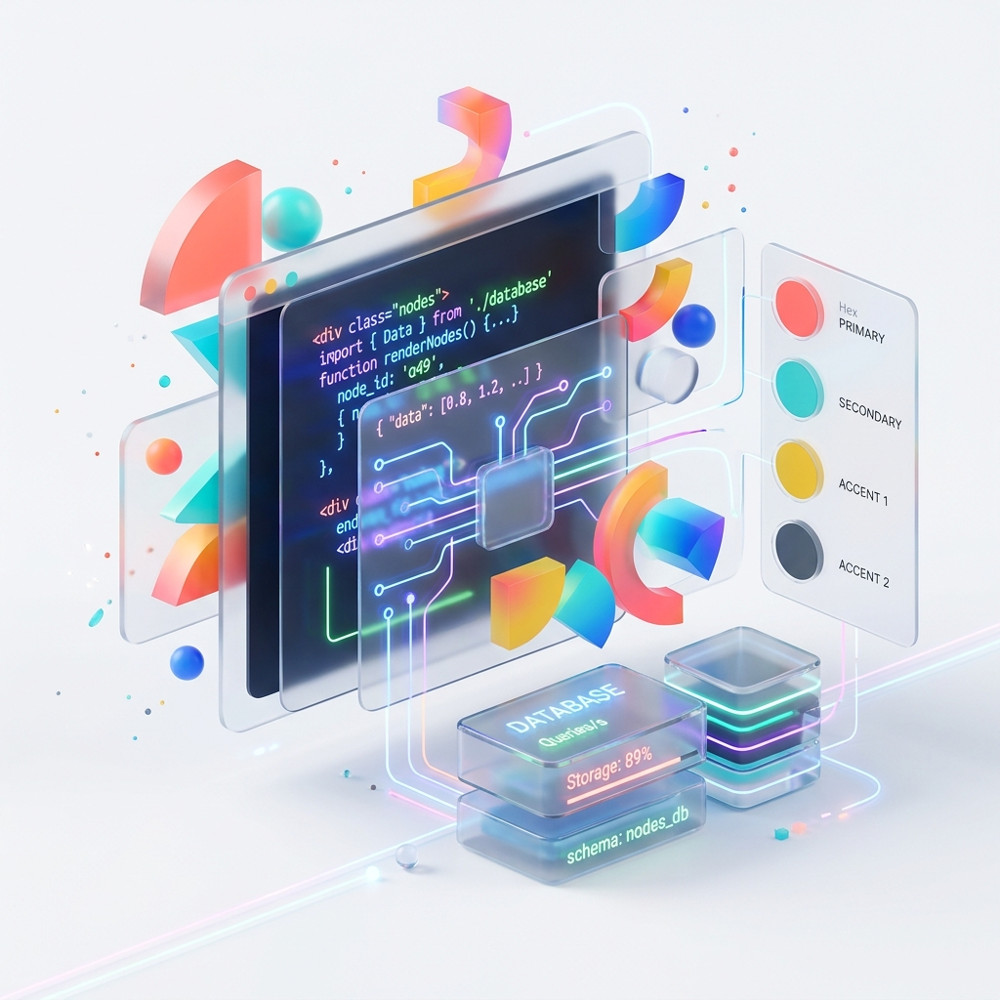

# ⚡ Marki Labs

Marki Labs, yenilikçi dijital çözümler, modern web tasarımı, özel yazılım geliştirme ve kurumsal dijital dönüşüm hizmetleri sunan modern bir teknoloji ve tasarım stüdyosudur.



---

## ✨ Öne Çıkan Özellikler

- 🚀 **Next.js 16 (Turbopack & App Router)** ile ultra hızlı sayfa yüklenmeleri ve SEO optimizasyonu
- 🎨 **Tailwind CSS v4 & Framer Motion** ile şık, dinamik ve akıcı kullanıcı deneyimi (UI/UX)
- 🛒 **Mağaza & Çözüm Kataloğu:** Kurumsal kimlik, web tasarım ve özel yazılım çözümleri
- 🌓 **Tema Kişiselleştirme:** Dinamik tema özelleştirici desteği
- 📄 **Yasal Uyum Sayfaları:** KVKK, Gizlilik Politikası ve Kullanım Koşulları tam entegrasyonu
- 📱 **Tamamen Responsive:** Mobil, tablet ve masaüstü cihazlarla kusursuz uyum

---

## 🛠️ Kullanılan Teknolojiler

| Teknoloji | Açıklama |
| :--- | :--- |
| **[Next.js 16](https://nextjs.org/)** | React Framework (App Router & Turbopack) |
| **[React 19](https://react.dev/)** | Kullanıcı Arayüzü Kütüphanesi |
| **[TypeScript](https://www.typescriptlang.org/)** | Tip Güvenli Kod Geliştirme |
| **[Tailwind CSS v4](https://tailwindcss.com/)** | Modern & Esnek Stil Altyapısı |
| **[Framer Motion](https://www.framer.com/motion/)** | Gelişmiş Animasyonlar ve Geçişler |
| **[Lucide React](https://lucide.dev/)** | Modern Vektörel İkon Seti |

---

## 🚀 Hızlı Başlangıç

Projeyi yerel ortamınızda çalıştırmak için aşağıdaki adımları izleyin:

### 1. Depoyu Klonlayın
```bash
git clone https://github.com/whyasaf/markiLabs.git
cd markiLabs
```

### 2. Bağımlılıkları Yükleyin
```bash
npm install
```

### 3. Geliştirme Sunucusunu Başlatın
```bash
npm run dev
```

Tarayıcınızda `http://localhost:3030` adresine giderek projeyi görüntüleyebilirsiniz.

---

## 📁 Proje Yapısı

```bash
marki-labs/
├── app/                  # Next.js App Router sayfaları & API rotaları
│   ├── biz-kimiz/        # Ekip & Hakkımızda sayfaları
│   ├── cozumler/         # Yazılım ve Tasarım çözümleri
│   ├── magaza/           # Ürün & Hizmet mağazası
│   ├── iletisim/         # İletişim sayfası
│   ├── kvkk/             # KVKK Aydınlatma Metni
│   ├── gizlilik/         # Gizlilik Politikası
│   └── kosullar/         # Kullanım Koşulları
├── components/           # Yeniden kullanılabilir UI bileşenleri (Navbar, Footer, vb.)
│   └── ui/               # Temel UI elementleri (Button, Card, vb.)
├── public/               # Statik görseller ve medya varlıkları
└── ...
```

---

## 📜 Lisans

Bu proje **Marki Labs** haklarına tabidir. Tüm hakları saklıdır.
